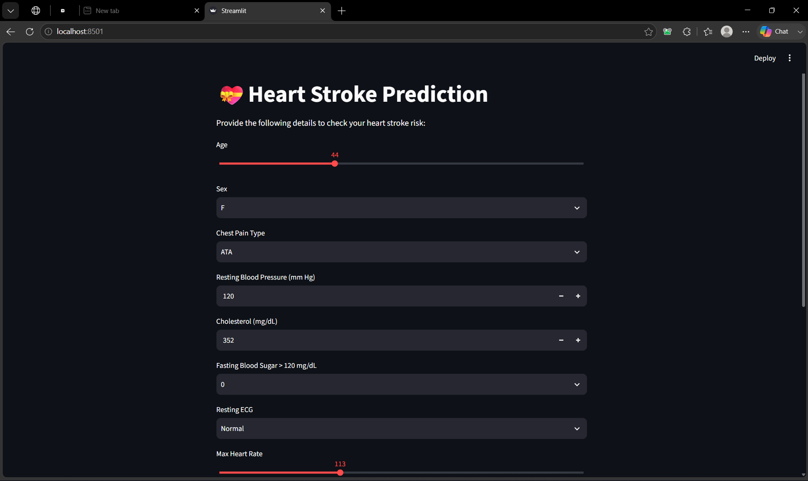
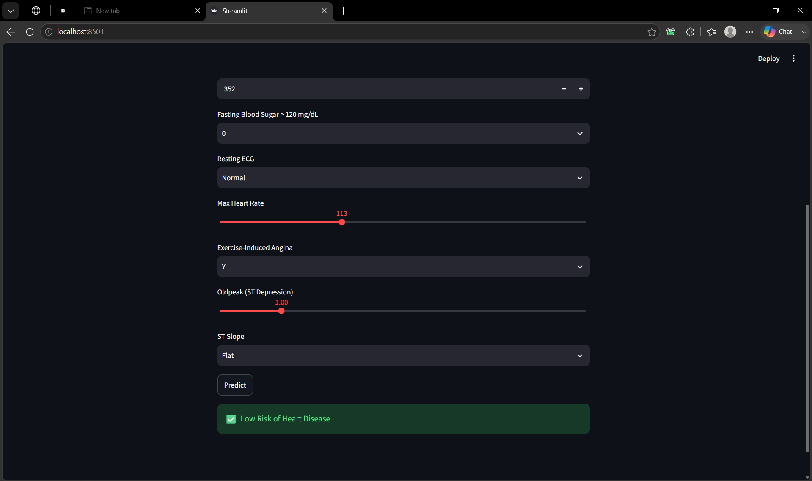
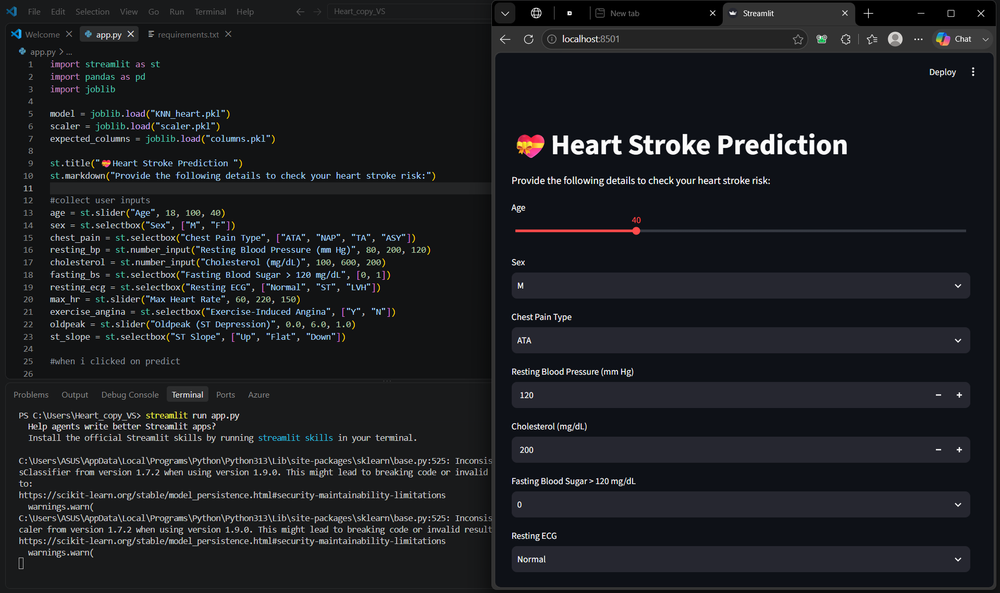

# 🫀 Heart Stroke Prediction

A Machine Learning based web application that predicts the likelihood of a person experiencing a stroke based on selected health and demographic parameters.

The project combines **Machine Learning, Python, Pandas,Seaborn, Scikit-learn, and Streamlit** to provide an easy-to-use interface for making predictions.

> **Note:** This project is created for educational and demonstration purposes. It is not intended to provide medical diagnosis or replace professional medical advice.

---

## 📌 Project Overview

Stroke is a serious health condition that can be influenced by several factors such as age, hypertension, heart disease, glucose level, BMI, smoking status, and other health-related attributes.

This project uses a Machine Learning model trained on stroke-related data to identify patterns in the dataset and generate a prediction based on user-provided input.

The trained model is integrated into a **Streamlit web application**, allowing users to interact with the model through a simple interface.

---

## ✨ Features

* 🧠 Machine Learning based stroke prediction
* 🖥️ Interactive Streamlit web application
* 📊 User-friendly input interface
* 📈 Data preprocessing and model training
* 🔍 Exploratory Data Analysis using Jupyter Notebook
* ⚡ Fast prediction through the trained model
* 📱 Simple and clean application interface

---

## 🛠️ Technologies Used

| Technology              | Purpose                           |
| ----------------------- | --------------------------------- |
| 🐍 Python               | Programming language              |
| 🧮 Pandas               | Data manipulation and analysis    |
| 🔢 NumPy                | Numerical operations              |
| 🤖 Scikit-learn         | Machine Learning                  |
| 📓 Jupyter Notebook     | Data analysis & model development |
| 🎨 Streamlit            | Web application                   |
| 📊 Matplotlib / Seaborn | Data visualization                |
| 🔧 Git & GitHub         | Version control                   |

---

## 🔄 Machine Learning Workflow

```text
Dataset
   ↓
Data Cleaning & Preprocessing
   ↓
Exploratory Data Analysis
   ↓
Feature Selection
   ↓
Model Training
   ↓
Model Evaluation
   ↓
Model Integration
   ↓
Streamlit Web Application
   ↓
Stroke Prediction
```

---

## 📊 Input Features

The application uses health and demographic information such as:

* Age
* Sex
* ChestPainType
* RestingBP
* Cholesterol
* FastingBS
* RestingECG
* MaxHR
* ExerciseAngina
* Oldpeak
* ST_Slope
* HeartDisease


These inputs are processed and passed to the trained Machine Learning model to generate a prediction.

---

## 🖥️ Application Screenshots

### 🔹 Application Home / Input Screen



### 🔹 Prediction Interface



### 🔹 Project / Code View



---

## 📂 Project Structure

```text
heart-stroke-prediction/
│
├── app.py
├── heart_stroke_prediction.ipynb
├── README.md
├── requirements.txt
│
├── Images/
│   ├── 1stView.png.png
│   ├── 2ndView.png.png
│   └── code+view.png.png
```

---

## ⚙️ Installation & Setup

### 1. Clone the repository

```bash
git clone https://github.com/shauryasaxena007/heart-stroke-prediction.git
```

### 2. Navigate to the project directory

```bash
cd heart-stroke-prediction
```

### 3. Install the required dependencies

```bash
pip install -r requirements.txt
```

### 4. Run the Streamlit application

```bash
python -m streamlit run app.py
```

The application will open in your browser.

---

## 🧪 Model Development

The Machine Learning model was developed using a Jupyter Notebook.

The notebook contains the major stages of the project, including:

1. Data loading
2. Data exploration
3. Data preprocessing
4. Handling missing values
5. Exploratory Data Analysis
6. Feature preparation
7. Model training
8. Model evaluation
9. Prediction

---

## 📈 Results

🏆 Selected Model: KNN

The K-Nearest Neighbors (KNN) algorithm was selected as the final model for the application.

The model achieved:

Accuracy: 89.13%
F1 Score: 90.29%

The trained KNN model is integrated into the Streamlit application to generate predictions based on the user's input.
---

## 🚀 Future Improvements

Some possible improvements for future versions include:

* Improve model performance through hyperparameter tuning
* Compare multiple Machine Learning algorithms
* Add additional evaluation metrics
* Improve the UI/UX of the Streamlit application
* Deploy the application online

---


## 👩‍💻 Author

**Shaurya Saxena**

Data Scientist & Machine Learning Enthusiast

---

## ⭐ Support

If you find this project useful, consider giving the repository a ⭐ on GitHub!
